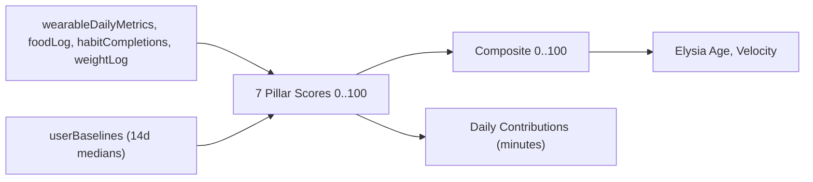

# Elysia Health Score & Aging Engine — Scoring Model v1

> Single source of truth for the Tier 1 longevity scoring pipeline.
> Every constant in `convex/scoring/**` MUST trace back to this document.
> When the model changes, bump the version and add an entry to
> [scoreModelVersions](#10-versioning-policy).

---

## 1. Overview

Elysia computes three layered outputs every day per user:

1. **Pillar Scores** — 7 Tier 1 pillars in v1, each `0..100`.
2. **Composite Elysia Health Score** — weighted average of available pillars, `0..100`.
3. **Aging Engine** — chronological vs. Elysia Age (years), Aging Velocity (years/year), and Daily Longevity Contributions in equivalent minutes of healthy life expectancy.

Pillars are evaluated **independently per day** against the user's personal **Baseline** (median of the first 14 days post-onboarding), with a Cohort fallback during calibration.



---

## 2. Pillar Catalogue

13 pillars are declared in v1 — 7 active (Tier 1), 6 stubbed (Tier 2/3). All future pillars share the same data contract:

```ts
type PillarDefinition = {
  id: PillarId;
  tier: 1 | 2 | 3;
  weight: number;          // share of composite (sums to 1.0 within ACTIVE pillars)
  lambda: number;          // years deducted/added from chrono age per full +50 score delta
  beta: number;            // minutes credited per +1 score point above baseline
  requiredSources: SourceId[];
  computeScore: (input, baseline) => number | null;
};
```

### 2.1 Tier 1 (8 active in v1.2.0)

| id            | label                  | weight | λ (yrs) | β (min/pt) |
|---------------|------------------------|--------|---------|------------|
| `sleep`       | Sleep                  | 0.18   | 2.0     | 1.2        |
| `recovery`    | Autonomic Recovery     | 0.13   | 1.5     | 1.0        |
| `cardio`      | Cardiorespiratory      | 0.20   | 3.0     | 1.5        |
| `activity`    | Daily Movement         | 0.09   | 2.0     | 1.2        |
| `bodyBasic`   | Body Basics            | 0.10   | 1.5     | 0.8        |
| `nutrition`   | Nutrition Quality      | 0.15   | 2.0     | 1.2        |
| `habits`      | Habit Consistency      | 0.05   | 0.5     | 0.4        |
| `stress`      | Stress & Mental Load   | 0.10   | 1.5     | 1.0        |

> The pillar weights sum to 1.00 within Tier 1. When Tier 2/3 pillars activate the weights are renormalised — see [§7 Composite Formula](#7-composite-formula).

### 2.2 Tier 2 (stubbed in v1.0.0, activated via partner data)

| id           | label                        | tier | planned source                       |
|--------------|------------------------------|------|---------------------------------------|
| `blood`      | Blood Biomarker Panel        | 2    | Partner-lab API ingest                |
| `bodyComp`   | Body Composition             | 2    | DEXA / InBody import                  |
| `metabolic`  | Metabolic Rate               | 2    | Indirect calorimetry partner          |

### 2.3 Tier 3 (stubbed in v1.0.0, activated via partner data)

| id          | label                         | tier | planned source                        |
|-------------|-------------------------------|------|---------------------------------------|
| `skin`      | Skin Age / Photoaging         | 3    | AI photo analysis or clinic partner   |
| `hair`      | Hair / Scalp Health           | 3    | Trichology partner                    |
| `genetic`   | Genetic Profile               | 3    | Consumer genomics upload              |

All Tier 2/3 entries are **declared in `pillarRegistry`** with `computeScore` returning `null` until activated. This guarantees `dailyHealthScores.pillarScores` always carries the full key set.

### 2.4 Wheel Layers (UI projection, v1.2.0+)

The mobile Longevity Wheel renders **6 concentric rings**, each one a pure aggregate over registered pillars. The mapping lives in `convex/scoring/displayLayers.ts` and is **UI-only** — pillars and weights are unchanged. `habits` intentionally has no layer; it surfaces as a separate "Consistency" pill under the wheel.

| layer id            | pillars                                                | tier required |
|---------------------|--------------------------------------------------------|---------------|
| `recoverySleep`     | `sleep`, `recovery`                                    | 1             |
| `stressPsyche`      | `stress`                                               | 1             |
| `movement`          | `activity`                                             | 1             |
| `cardioMetabolic`   | `cardio`, `bodyBasic`                                  | 1             |
| `nutrition`         | `nutrition`                                            | 1             |
| `biomarkers`        | `blood`, `bodyComp`, `metabolic`, `skin`, `hair`, `genetic` | 2/3      |

Each `layerScore` is the **pillar-weight-weighted mean** of the constituent pillar scores. Null when all pillars are null. Persisted on `dailyHealthScores.layerScores` so the UI never re-aggregates.

---

## 3. Source Catalogue

Each pillar declares which data sources it needs. Composite only weights a pillar if at least one of its required sources is active for the user/day.

| SourceId            | maps to                                              |
|---------------------|------------------------------------------------------|
| `wearableDaily`     | `wearableDailyMetrics`                               |
| `weightLog`         | `weightLog`                                          |
| `foodLog`           | `foodLog` + `energyBalanceDaily`                     |
| `habitCompletions`  | `habits` + `habitCompletions`                        |
| `labPanel`          | (Tier 2 — future)                                    |
| `bodyCompositionScan` | (Tier 2 — future)                                  |
| `geneticReport`     | (Tier 3 — future)                                    |
| `skinAssessment`    | (Tier 3 — future)                                    |

---

## 4. Dose-Response Functions

All dose-response functions are **piecewise linear**, monotone within each branch, plateau in the "healthy" zone. The exact knots are defined here so that `convex/scoring/doseResponse.ts` and its tests are derivable from this spec.

Notation: `pwl([[x0,y0],[x1,y1],...])` is piecewise linear interpolation clipped to `[0,1]` at the endpoints.

### 4.1 Sleep Pillar (`sleep`)

Inputs (from `wearableDailyMetrics`): `sleepMinutes`, `sleepEfficiencyPct`, `sleepConsistencyPct`, `sleepDeepMinutes`, `sleepRemMinutes`.

| sub-score          | weight | function                                                                 |
|--------------------|--------|--------------------------------------------------------------------------|
| `f_duration(min)`  | 0.45   | `pwl([[300,0.0],[360,0.5],[420,0.85],[480,1.0],[540,1.0],[600,0.85],[720,0.5]])` |
| `f_efficiency(%)`  | 0.25   | `pwl([[70,0.0],[80,0.5],[88,0.85],[92,1.0],[100,1.0]])`                  |
| `f_consistency(%)` | 0.15   | `pwl([[40,0.0],[60,0.4],[75,0.7],[85,1.0],[100,1.0]])`                   |
| `f_restorative(min)` | 0.15 | `pwl([[60,0.0],[90,0.4],[120,0.7],[180,1.0],[300,1.0]])` (deep+rem)      |

Sources: Cappuccio 2010 meta (U-curve at 7-8h), Hirshkowitz 2015 NSF, Walker 2017 "Why We Sleep" — efficiency >= 85% is clinical threshold; consistency literature (Lunsford-Avery 2018).

Score: `sleep = 100 * Σ sub_i * weight_i`. Returns `null` if `sleepMinutes` missing.

### 4.2 Recovery Pillar (`recovery`)

Inputs: `hrvAvgMs`, `restingHrBpm`, `respiratoryRateAvg`.

Personal-baseline-relative (uses `userBaselines.metrics.{hrvMedian,rhrMedian,respMedian}` if available; else cohort defaults).

| sub-score        | weight | function (relative to baseline `b`)                                             |
|------------------|--------|---------------------------------------------------------------------------------|
| `f_hrv(v,b)`     | 0.50   | `pwl([[-30,0],[-15,0.4],[0,0.7],[10,1.0],[25,1.0]])` over `(v-b)/b*100`         |
| `f_rhr(v,b)`     | 0.35   | `pwl([[15,0],[8,0.3],[2,0.7],[-2,1.0],[-10,1.0]])` over `(v-b)/b*100` (inverted)|
| `f_resp(v,b)`    | 0.15   | `pwl([[5,0],[3,0.4],[1,0.7],[0,1.0],[-2,1.0]])` over `(v-b)`                    |

Sources: Hillebrand 2013 (HRV mortality), Aune 2017 BMC (RHR each +10bpm = +9% mortality), Stein 2011 (respiratory rate baseline drift).

Cohort defaults: `hrv=45ms`, `rhr=62bpm`, `resp=15`.

Score: `recovery = 100 * Σ sub_i * weight_i`. Returns `null` if HRV AND RHR both missing.

### 4.3 Cardiorespiratory Pillar (`cardio`)

Inputs: `vo2Max` (preferred), `restingHrBpm`, `hrMaxBpm` (estimated when missing).

Age and sex adjusted percentile from FRIEND/ACSM tables.

| sub-score          | weight | function                                                                                 |
|--------------------|--------|------------------------------------------------------------------------------------------|
| `f_vo2_percentile(p)` | 0.70 | `pwl([[10,0],[25,0.35],[50,0.65],[75,0.9],[90,1.0]])` over age/sex percentile             |
| `f_rhr(bpm)`       | 0.30   | `pwl([[80,0],[70,0.4],[60,0.7],[55,0.9],[45,1.0]])` (absolute, not baseline)              |

VO₂max percentile tables (`cohortPercentile(vo2, age, sex)`) — FRIEND registry (Kaminsky 2015), abbreviated table embedded in `convex/scoring/percentiles/vo2max.ts`.

Sources: Mandsager 2018 JAMA (top vs bottom quartile CRF mortality HR 5.0), Ross 2016 AHA CRF statement.

Score: `cardio = 100 * Σ sub_i * weight_i`. Returns `null` if both `vo2Max` and `restingHrBpm` missing.

### 4.4 Activity Pillar (`activity`)

Inputs: `steps`, `activeKcal`, `workoutCount`, `workoutKcal`.

| sub-score             | weight | function                                                                  |
|-----------------------|--------|---------------------------------------------------------------------------|
| `f_steps(n)`          | 0.45   | `pwl([[0,0],[2000,0.2],[4000,0.45],[6000,0.7],[8000,0.9],[10000,1.0],[15000,1.0]])` |
| `f_active_kcal(k)`    | 0.30   | `pwl([[0,0],[150,0.3],[300,0.6],[500,0.9],[800,1.0]])`                    |
| `f_workout_load(min)` | 0.25   | `pwl([[0,0],[15,0.4],[30,0.75],[45,1.0],[120,1.0]])` (proxy: kcal/8)      |

Sources: Paluch 2022 Lancet PH (steps mortality plateau ~6-8k for older, ~8-10k for younger), Garcia 2023 JAMA (10k cap), Lee 2014 (MVPA).

Score: `activity = 100 * Σ sub_i * weight_i`. Returns `null` if `steps` missing AND `activeKcal` missing.

### 4.5 Body Basics Pillar (`bodyBasic`)

Inputs: `weightKg` (latest), `heightCm`, `dateOfBirth`, `sex` (from `profiles`); `weightLog` 28-day trend.

BMI U-curve + weight stability bonus.

| sub-score          | weight | function                                                                                |
|--------------------|--------|-----------------------------------------------------------------------------------------|
| `f_bmi(bmi)`       | 0.70   | `pwl([[15,0],[18.5,0.5],[20,0.85],[22,1.0],[24.9,1.0],[27,0.85],[30,0.5],[35,0.2],[40,0]])` |
| `f_stability(cv)`  | 0.30   | `pwl([[10,0],[5,0.4],[2,0.85],[1,1.0],[0,1.0]])` (28d coefficient of variation %)        |

> Body Basics is intentionally Tier 1 (anthropometry from user input). Full body composition (FFM, fat %) is the Tier 2 `bodyComp` pillar and supersedes this when active.

Sources: Aune 2016 BMJ (BMI all-cause mortality U-curve; nadir ~22-24), Bangalore 2015 (weight variability raises mortality HR 1.33).

Score: `bodyBasic = 100 * Σ sub_i * weight_i`. Returns `null` if `weightKg` or `heightCm` missing.

### 4.6 Nutrition Pillar (`nutrition`)

Inputs (from `energyBalanceDaily` + `foodLog`): `macroCompliancePct`, `proteinPerKg`, `balanceKcal`, fiber/processed flags (future).

| sub-score             | weight | function                                                                  |
|-----------------------|--------|---------------------------------------------------------------------------|
| `f_macro_compliance(p)` | 0.40 | `pwl([[0,0],[50,0.4],[75,0.75],[90,1.0],[100,1.0]])`                       |
| `f_protein_per_kg(p)` | 0.30   | `pwl([[0.4,0],[0.8,0.4],[1.2,0.85],[1.6,1.0],[2.4,1.0],[3.0,0.85]])`      |
| `f_energy_balance(d)` | 0.30   | `pwl([[-1000,0.3],[-500,0.85],[0,1.0],[500,0.85],[1000,0.3]])` (kcal delta vs TDEE) |

Sources: Phillips 2016 (protein 1.2-1.6 g/kg for adults), Trumbo 2002 DRIs, Hooper 2020 macro adherence systematic review.

Score: `nutrition = 100 * Σ sub_i * weight_i`. Returns `null` if `macroCompliancePct` missing.

### 4.7 Habit Consistency Pillar (`habits`)

Inputs: `habits` (active count, by category), `habitCompletions` (last 14d).

| sub-score              | weight | function                                                                                 |
|------------------------|--------|------------------------------------------------------------------------------------------|
| `f_adherence_14d(p)`   | 0.60   | `pwl([[0,0],[40,0.4],[60,0.7],[80,0.9],[95,1.0]])` over % of expected completions met    |
| `f_category_breadth(c)`| 0.20   | `pwl([[0,0],[1,0.4],[2,0.7],[3,0.9],[4,1.0]])` over distinct active categories           |
| `f_streak_factor(s)`   | 0.20   | `pwl([[0,0.2],[3,0.5],[7,0.8],[14,1.0],[30,1.0]])` over max active streak (days)         |

Sources: behaviour-change literature is correlative; this pillar is treated as a **modifier** with deliberately low λ (0.5y) and β (0.4 min/pt).

Score: `habits = 100 * Σ sub_i * weight_i`. Returns `null` if active habit count is 0.

### 4.8 Stress Pillar (`stress`, added in v1.2.0)

Inputs (all derived from existing wearable signals — no new ingestion required):

- `recentWearable.hrvAvgMs[]` (trailing 3–7 days incl. today)
- `wearableDaily.sleepAwakeMinutes`, `wearableDaily.sleepEfficiencyPct`
- `wearableDaily.respiratoryRateAvg` + `userBaselines.metrics.respMedian`

Sub-score derivations:

```
hrvCvPct          = (sd(recentHrv) / mean(recentHrv)) * 100   # coefficient of variation, %
fragmentationRaw  = sleepAwakeMinutes + max(0, 100 - sleepEfficiencyPct)
respDeviationPct  = |respiratoryRateAvg - respMedian| / respMedian * 100
```

| sub-score              | weight | function                                                                  |
|------------------------|--------|---------------------------------------------------------------------------|
| `f_stress_hrv_cv(cv)`  | 0.45   | `pwl([[0,1.0],[5,1.0],[10,0.85],[15,0.6],[25,0.3],[40,0.0]])`             |
| `f_stress_frag(raw)`   | 0.35   | `pwl([[0,1.0],[10,0.9],[25,0.65],[40,0.4],[60,0.15],[100,0.0]])`          |
| `f_stress_resp(dev)`   | 0.20   | `pwl([[0,1.0],[3,0.9],[7,0.7],[12,0.4],[20,0.15],[30,0.0]])`              |

Higher score = lower observed stress. Score returns `null` when neither a ≥3-day HRV window nor today's sleep efficiency / awake time is available.

Sources: Shaffer 2017 (HRV variability, autonomic load), Knutson 2007 (sleep fragmentation & cortisol), Saboul 2014 (resp drift as ANS stress proxy). λ = 1.5y, β = 1.0 min/pt — mirrors `recovery` because the underlying autonomic mechanism is shared.

---

## 5. Calibration Phase

Each user enters a 14-day calibration window starting from onboarding.

- **Days 1–14**: `userBaselines.status = "calibrating"`. Daily Pillar Scores are still computed against cohort defaults so the user sees values, but **`agingTrajectory` is NOT written** during this window.
- **Day 14 (cron)**: compute `userBaselines.metrics` as medians across the window. Set `status = "ready"`, write `daysCalibrated = 14`.
- **Day 15+**: Pillar Scores use the personal baseline. `agingTrajectory.confidence` starts at `0.6` on day 15 and ramps linearly to `1.0` by day 90.
- **Re-baselining**: After 180 days, if median drift > 15% on any key metric, schedule a `status = "stale"` review with optional re-baseline action.

**Cohort defaults** (when baseline missing or user has zero baseline data):

| metric        | default | source                          |
|---------------|---------|---------------------------------|
| `hrvMedian`   | 45 ms   | Voss 2015 healthy adult median  |
| `rhrMedian`   | 62 bpm  | Bonnemeier 2003                 |
| `sleepMedian` | 420 min | NSF 2015                        |
| `stepsMedian` | 7000    | Bassett 2010 NHANES             |
| `respMedian`  | 15      | Ganong 23rd ed                  |

---

## 6. Pillar Score Composition

For each pillar:

```
pillarScore = round(100 * Σ_i sub_i * weight_i)
```

Returns `null` when **required input is missing**. Per-pillar "required" inputs are defined in §4 above. Pillars returning `null` are excluded from composite and never produce contributions.

---

## 7. Composite Formula

```
activePillars  = pillars where computeScore != null
totalWeight    = Σ weight_p for p in activePillars
composite      = round( Σ_p score_p * weight_p / totalWeight )

coverage       = (count(activePillars in Tier 1) / 7) clamped 0..1
tierLevel      = max tier across activePillars (1 by default)
```

If no Tier 1 pillar is active: `composite = null`, `tierLevel = null`. The Aging Engine is skipped for that day.

When Tier 2 pillars activate (later), the renormalisation step (`/ totalWeight`) absorbs them automatically — no Tier 1 weight changes needed.

---

## 8. Elysia Age & Aging Engine

### 8.1 Elysia Age (years)

```
ageDelta = Σ_p λ_p * (score_p - 50) / 50      for p in activePillars
ageDelta = clamp(ageDelta, -10, +10)
elysiaAge = chronoAge - ageDelta
```

- `score_p = 50` is "neutral" (no impact on age).
- `score_p = 100` shifts age **down** by full `λ_p`.
- `score_p = 0` shifts age **up** by full `λ_p`.
- Hard cap ±10 years to prevent runaway from data anomalies.

### 8.2 Aging Velocity (years/year)

```
velocity28d = slope( (elysiaAge - chronoAge) over last 28 days, x = day index )
            * (365 / 28)
```

Computed via OLS. Requires ≥ 14 data points in the window or returns `null`.

- `velocity = 0`: aging at chronological rate.
- `velocity > 0`: aging faster than chrono.
- `velocity < 0`: aging slower (healthspan gain).

### 8.3 Daily Longevity Contributions (minutes)

For each active pillar:

```
baselineScore_p   = median pillar score over the prior 28 days
                    (or cohort baseline 50 during calibration)
contribution_p    = (score_p_today - baselineScore_p) * β_p     [in minutes]
rationale_p       = short human-readable string (e.g. "Sleep 6h vs your avg 7h")
```

Sum of `contribution_p` is the WHOOP-style "minutes added/lost today" figure displayed by `LongevityPerformanceView`.

---

## 9. Confidence

```
confidence = base * coverage
where
  base = 0.0                          if status == "calibrating"
       = 0.6 + 0.4 * (daysCal - 14)/76 (clipped to 1.0)   if status == "ready"
```

`confidence` is exposed to UI so the user knows how much to trust the score (greyed orb during calibration, full color after 90 days of data).

---

## 10. Versioning Policy

Every change to weights, λ, β, or dose-response knots requires a new entry in `scoreModelVersions`:

| version | trigger                                                |
|---------|--------------------------------------------------------|
| `1.0.0` | Initial release — 3 Tier-1 pillars active (Sleep, Recovery, Activity); rest stubbed |
| `1.1.0` | All 7 Tier-1 pillars active (Cardio, Body Basics, Nutrition, Habits added) |
| `1.2.0` | 8th Tier-1 pillar `stress` added (HRV-CV + sleep fragmentation + resp deviation). Activity 0.15→0.09, Recovery 0.15→0.13, Habits 0.07→0.05 to make room. `layerScores`, `trajectoryStatus`, `healthspanCreditsToday` persisted on `dailyHealthScores`. |
| `2.0.0` | First Tier 2 pillar (Blood Panel) goes live            |
| `3.0.0` | First Tier 3 pillar (Skin or Genetics) goes live       |

Historical `dailyHealthScores`/`agingTrajectory` rows reference the version that produced them. Recomputes write under the new version, the prior rows are kept for trend continuity.

---

## 11. Bibliography

Studies cited above (short refs; full citation in `docs/analytics/references.bib` once added):

- Cappuccio FP et al. *Sleep duration and all-cause mortality*. Sleep, 2010.
- Hirshkowitz M et al. *National Sleep Foundation sleep duration recommendations*. Sleep Health, 2015.
- Mandsager K et al. *Association of cardiorespiratory fitness with long-term mortality*. JAMA, 2018.
- Kaminsky LA et al. *FRIEND registry CRF reference values*. Mayo Clin Proc, 2015.
- Ross R et al. *AHA Scientific Statement: importance of CRF*. Circulation, 2016.
- Paluch AE et al. *Daily steps and all-cause mortality*. Lancet Public Health, 2022.
- Garcia L et al. *Steps and incident type-2 diabetes / mortality*. JAMA Network Open, 2023.
- Lee IM et al. *Effect of physical inactivity on major non-communicable diseases worldwide*. Lancet, 2014.
- Aune D et al. *BMI and all-cause mortality*. BMJ, 2016.
- Aune D et al. *Resting heart rate and risk of cardiovascular disease*. BMC Med, 2017.
- Bangalore S et al. *Body-weight fluctuations and outcomes*. NEJM, 2015.
- Hillebrand S et al. *HRV and risk of mortality*. Europace, 2013.
- Stein PK et al. *Respiratory rate and outcomes*. Cardiology J, 2011.
- Voss A et al. *HRV reference values for healthy adults*. Cardiology, 2015.
- Bonnemeier H et al. *Circadian profile of RHR in healthy subjects*. JCE, 2003.
- Phillips SM et al. *Protein requirements for adults*. Appl Physiol Nutr Metab, 2016.
- Trumbo P et al. *DRIs for macronutrients*. J Am Diet Assoc, 2002.
- Hooper L et al. *Macronutrient adherence systematic review*. Cochrane, 2020.
- Walker MP. *Why We Sleep*. Scribner, 2017.
- Lunsford-Avery JR et al. *Sleep regularity and health*. Sci Rep, 2018.
